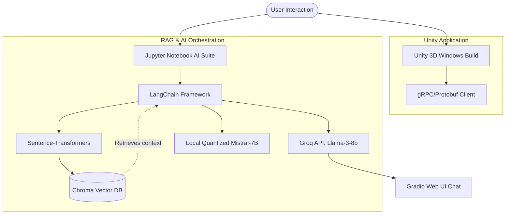

# 🏛️ BGSCET Hackathon: Indian Culture & Tourism AI Suite

An immersive, AI-powered ecosystem designed to celebrate, explore, and navigate the rich heritage and landmarks of India. Developed for the **BGSCET Hackathon**, this project seamlessly bridges a **3D Interactive Unity Experience** with advanced **Retrieval-Augmented Generation (RAG)** systems and **Generative AI pipelines** to deliver intelligent question answering, context-aware itinerary planning, and traditional storytelling.

---

## 💡 Project Overview

The **Culture & Tourism AI Suite** addresses the challenge of making cultural exploration engaging and personalized. It provides:
1. **Immersive Interaction**: A standalone 3D Windows experience built in Unity, designed to visualize Indian monuments and cultural hubs.
2. **Intelligent Travel Planning**: An agentic itinerary generator that crafts structured, culturally conscious travel schedules based on user preferences.
3. **Conversational Heritage Knowledge**: A Gradio-based RAG chat assistant that reads historical text documents and resolves user queries about Indian traditions.
4. **Folklore Generation**: A localized storytelling engine running quantized LLMs to generate folklore from different Indian states.

---

## 🚀 Key Features

*   **Interactive 3D Simulation**: Standalone interactive environment showcasing Indian architecture, packaged with high-performance plugins (gTFast) and integrated with gRPC-based backend communication support.
*   **Semantic RAG Pipelines**:
    *   Powered by LangChain and ChromaDB.
    *   Uses high-accuracy embedding models (`all-mpnet-base-v2`, `all-MiniLM-L6-v2`) to encode cultural textbooks and tourism PDFs.
*   **Agentic Travel Companion**: Parses queries dynamically and uses a prompt-engineered Llama-3-8b model via Groq to create detailed day-by-day travel itineraries complete with activity schedules, travel times, dining advice, and cultural tips.
*   **Web Interfaces**: Gradio UI widgets directly hosted from Jupyter Notebooks for real-time interaction.
*   **Quantized Offline Storytelling**: Demonstrates localized inference using a 4-bit quantized Mistral-7B-Instruct model (nf4 quantization via `bitsandbytes`) for storytelling.

---

## 🛠️ Architecture & Tech Stack



### **Technologies Used**
*   **Interactive Frontend**: Unity Engine, C#, glTFast (GLTF asset streaming), gRPC (communication).
*   **AI/LLM Core**: LangChain, HuggingFace Transformers, BitsAndBytes (4-bit quantization), Accelerate.
*   **Vector Database**: ChromaDB.
*   **Models**: Llama-3-8b-8192 (via Groq API), Mistral-7B-Instruct-v0.1, sentence-transformers (`all-mpnet-base-v2`, `all-MiniLM-L6-v2`).
*   **Deployment & UI**: Gradio Web Interface.

---

## 📂 Directory Structure

```filepath
BGSCET-Hack/
├── culture.exe                 # Standalone Unity executable for Windows
├── culture_Data/               # Unity application assets, resources, and dependencies
│   ├── Managed/                # Compiled Assemblies (including gRPC, Protobuf, Unity UI)
│   └── Plugins/                # Architecture plugins and drivers
├── MonoBleedingEdge/           # Unity Mono scripting runtime
├── UnityPlayer.dll             # Unity rendering engine dependency
├── BGSCET_Project.ipynb        # RAG pipeline with Gradio UI & Groq integration
├── Culture_Tourism (1).ipynb   # Integrated RAG development and DB ingestion
├── itinerary.ipynb             # Agentic Travel Itinerary Planner (ChromaDB + Llama-3)
├── BGS_hack.ipynb              # Local Quantized Mistral-7B folklore story teller
├── data.py                     # Project configuration/data hook (placeholder)
├── .gitattributes              # Git attributes (LFS configuration for binaries)
└── README.md                   # Project documentation
```

---

## ⚙️ Setup & Installation

### **1. Windows Unity Build**
Simply run **`culture.exe`** on a 64-bit Windows machine. Ensure the `culture_Data`, `MonoBleedingEdge` directories, and `UnityPlayer.dll` remain in the same root folder.
*   *Note: Binaries are tracked via Git Large File Storage (LFS).*

### **2. AI Suite & Notebooks Environment**
To run the Jupyter Notebooks (`.ipynb` files), set up a Python 3.10+ environment:

```bash
# Clone the repository
git clone https://github.com/ananttewari/BGSCET-Hack.git
cd BGSCET-Hack

# Create and activate virtual environment
python -m venv venv
venv\Scripts\activate

# Install essential dependencies
pip install -q langchain langchain-groq langchain-community langchain-core chromadb sentence-transformers unstructured pypdf gradio transformers bitsandbytes accelerate PyPDF2 tqdm
```

---

## 📖 How to Use the Notebooks

### **1. Cultural Q&A Assistant (`BGSCET_Project.ipynb` & `Culture_Tourism (1).ipynb`)**
*   **Description**: Ingests cultural documentation from a specified folder (PDFs/TXTs) and generates text chunk embeddings using `all-MiniLM-L6-v2`. It stores them in ChromaDB and launches a Gradio UI allowing users to ask questions regarding Indian culture.
*   **Configuration**:
    1. Open the notebook and update the folder path of your source materials: `directory_path = "/path/to/Culture_and_Quiz"`.
    2. Add your Groq API Key:
        ```python
        os.environ["GROQ_API_KEY"] = "YOUR_GROQ_API_KEY"
        ```
    3. Run all cells to launch the Gradio public link.

### **2. Travel Itinerary Planner (`itinerary.ipynb`)**
*   **Description**: Implements the `ItineraryAgent` to ingest travel guides, split documents semantically, extract location metadata, and generate beautiful travel plans.
*   **Itinerary Format Output**:
    ```text
    DAY 1
    ------
    - Morning: Visit monument/temple as per retrieved context.
    - Afternoon: Local bazaar/museum.
    - Evening: Traditional dance show or sunset view.
    - Travel Time: 30 mins approx.
    - Food Suggestions: Local restaurant matching the region.
    - Cultural Tips: Dress modestly, remove shoes.
    ```
*   **Configuration**: Run the cells and input your Groq-compatible OpenAI endpoint details when prompted.

### **3. Local Folklore & Storytelling LLM (`BGS_hack.ipynb`)**
*   **Description**: Downloads `Mistral-7B-Instruct-v0.1`, applies 4-bit Double Quantization via `bitsandbytes` (so it runs smoothly on consumer GPUs), and generates traditional folk stories from Indian states.
*   **Configuration**: Ensure you have CUDA installed on your machine (`device_map="auto"` uses GPU acceleration) and run the cells.
